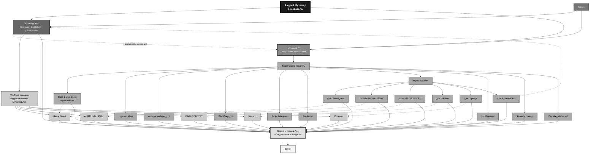

# Muhamed_Plan   

**Muhamed_Plan** — центральный стратегический документ экосистемы **Muhamed Ads**, в котором собраны ключевые идеи, планы развития, архитектурные решения, внутренние стандарты и видение будущего проекта.

Документ выступает **единой точкой координации** для всей экосистемы, помогая структурировать работу над текущими и будущими проектами. Именно здесь определяются основные направления развития, приоритетные задачи, технические решения, концепции новых сервисов, а также долгосрочные цели бренда.

---

## Стратегическая структура

### Основатели

| Роль               | Имя            | Ответственность                                                                                           |
| ------------------ | -------------- | --------------------------------------------------------------------------------------------------------- |
| Главный основатель | Андрей Мухамед | Стратегия, архитектура экосистемы, развитие бренда, ключевые партнёрства, принятие стратегических решений |
| Сооснователь       | Партнёр        | Развитие направления `Muhamed Ads`, техническая поддержка, операционное управление                        |

---

### Ключевые команды

#### 1. Muhamed Ads (Управляющее и маркетинговое направление)

* **Функция:** реклама, развитие продуктов, стратегическое управление медиапроектами.
* **Обязанности:**

  * Маркетинг и продвижение всех продуктов экосистемы.
  * Управление YouTube-каналами (контент-стратегия, дистрибуция, монетизация).
  * Координация работы технического подразделения.
  * Выступает в качестве основного публичного бренда, под которым выпускаются все продукты.

#### 2. Muhamed IT (Техническое направление)

* **Функция:** полный цикл разработки технологий и технических решений.
* **Обязанности:**

  * Разработка веб-сайтов, Telegram-ботов и серверной инфраструктуры.
  * Создание и поддержка мультиссылок для всех проектов.
  * Техническое обеспечение работы YouTube-каналов (интеграции, автоматизация).
  * Разработка внутренних инструментов для автоматизации бизнес-процессов.

---

## Медиа-проекты (YouTube-каналы)

*Все каналы управляются командой **Muhamed Ads**.*

| Канал              | Тематика                                       |
| ------------------ | ---------------------------------------------- |
| **Game Quest**     | Игровой контент, летсплеи, обзоры игр          |
| **ANIME INDUSTRY** | Новости, подборки и обзоры аниме               |
| **KINO INDUSTRY**  | Подборки новинок кино, сериалов и мультфильмов |
| **Nanson**         | Бесплатная музыка без авторских прав           |
| **Стримус**        | Развлекательный контент, стримы, трейлеры      |

> Для каждого из этих каналов предусмотрена отдельная **мультиссылка** (сборник всех социальных сетей и платформ).

---

## Технические продукты (разработка Muhamed IT)

### Веб-сайты

* **Сайт Game Quest** — находится в разработке.
* Другие сайты для будущих проектов (планируются).

### Боты для Telegram и других платформ

| Бот                     | Назначение                                              |
| ----------------------- | ------------------------------------------------------- |
| **Autorespondepro_bot** | Автоматизация ответов и рассылок                        |
| **WishKeep_bot**        | Сервис для хранения желаний, списков и закладок         |
| **ProjectManager**      | Инструмент для управления внутренними проектами команды |
| **ProAssist**           | Универсальный помощник для решения бизнес-задач         |

### Другие технические решения

* **Url Muhamed** — сервис сокращения ссылок с аналитикой.
* **Server Muhamed** — собственная серверная инфраструктура для хостинга всех сервисов.
* **Website_Muhamed** — основной корпоративный сайт бренда Muhamed Ads.

### Мультиссылки

Отдельные мультиссылки (landing-страницы со всеми ссылками) созданы для:

1. Game Quest
2. ANIME INDUSTRY
3. KINO INDUSTRY
4. Nanson
5. Стримус
6. Muhamed Ads (центральная мультиссылка бренда)

---

## Политика брендинга

> **Бренд "Muhamed Ads"** является единым объединяющим центром для:
>
> * всех технических продуктов (сайты, боты, серверы);
> * всех медиапроектов (YouTube-каналы);
> * всех рекламных кампаний.

Это обеспечивает:

* единую узнаваемость на рынке;
* синергию между техническими решениями и контентом;
* централизованное управление репутацией.

---

## Визуализация архитектуры

Приведённая ниже схема показывает иерархию, связи между командами и поток продуктов от разработки до выхода на рынок.

---

## Связь и поддержка

Мы всегда открыты к общению, новым идеям и сотрудничеству. По всем вопросам обращайтесь:

- Telegram-канал: https://t.me/muhamedlabs
- Email: partners@muhamedlabs.pro
- Discord: https://discord.com/users/768782555171782667

 

   2023-2028 Muhamed IT  

