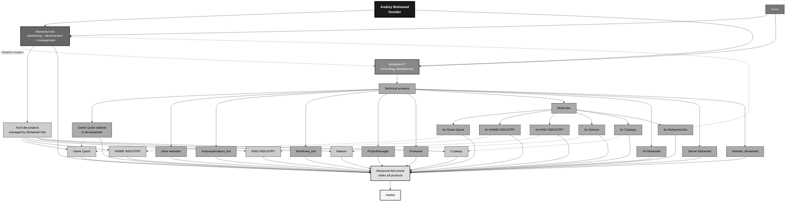

# Muhamed_Plan   

**Muhamed_Plan** is the central strategic document of the **Muhamed Ads** ecosystem, bringing together key ideas, development plans, architectural decisions, internal standards, and the long-term vision of the project.

The document serves as a **single coordination center** for the entire ecosystem, helping to organize work on both current and future projects. It defines the main development directions, priority objectives, technical solutions, concepts for new services, and the long-term goals of the brand.

---

## Strategic Structure

### Founders

| Role | Name | Responsibilities |
|------|------|------------------|
| Founder & CEO | Andrey Muhamed | Strategy, ecosystem architecture, brand development, key partnerships, strategic decision-making |
| Co-Founder | Partner | Development of the `Muhamed Ads` division, technical support, operational management |

---

### Core Teams

#### 1. Muhamed Ads (Management & Marketing Division)

- **Function:** advertising, product growth, and strategic management of media projects.
- **Responsibilities:**
  - Marketing and promotion of all ecosystem products.
  - Managing YouTube channels (content strategy, distribution, monetization).
  - Coordinating the work of the technical division.
  - Acting as the primary public-facing brand under which all products are released.

#### 2. Muhamed IT (Technical Division)

- **Function:** full-cycle development of technologies and technical solutions.
- **Responsibilities:**
  - Development of websites, Telegram bots, and server infrastructure.
  - Creation and maintenance of multilinks for all projects.
  - Technical support for YouTube channels (integrations, automation).
  - Development of internal tools for business process automation.

---

## Media Projects (YouTube Channels)

*All channels are managed by the **Muhamed Ads** team.*

| Channel | Category |
|----------|------------|
| **Game Quest** | Gaming content, let's plays, game reviews |
| **ANIME INDUSTRY** | Anime news, recommendations, and reviews |
| **KINO INDUSTRY** | Movie, TV series, and animation content |
| **Nanson** | Royalty-free music |
| **Streamus** | Entertainment content, livestreams, and trailers |

> Each channel has its own dedicated **multilink page** containing all related social media accounts and platforms.

---

## Technical Products (Developed by Muhamed IT)

### Websites

- **Game Quest Website** — currently under development.
- Additional websites for future projects (planned).

### Telegram & Platform Bots

| Bot | Purpose |
|-----|-------------|
| **Autorespondepro_bot** | Automation of replies and messaging campaigns |
| **WishKeep_bot** | Service for storing wishes, lists, and bookmarks |
| **ProjectManager** | Internal project management tool |
| **ProAssist** | Universal assistant for business-related tasks |

### Other Technical Solutions

- **Url Muhamed** — URL shortening service with analytics.
- **Server Muhamed** — private server infrastructure for hosting all services.
- **Website_Muhamed** — the main corporate website of the Muhamed Ads brand.

### Multilinks

Dedicated multilinks (landing pages containing all relevant links) are created for:

1. Game Quest
2. ANIME INDUSTRY
3. KINO INDUSTRY
4. Nanson
5. Streamus
6. Muhamed Ads (central brand multilink)

---

## Branding Policy

> The **"Muhamed Ads"** brand serves as the unified center for:
> - all technical products (websites, bots, servers);
> - all media projects (YouTube channels);
> - all advertising campaigns.

This provides:

- consistent brand recognition;
- synergy between technical solutions and media content;
- centralized reputation management.

---

## Architecture Visualization

The diagram below illustrates the hierarchy, team relationships, and product flow from development to market deployment.

---

## Contact and support

We are always open to communication, new ideas, and collaboration. For any questions, please contact:

- Telegram channel: https://t.me/muhamedlabs
- Email: partners@muhamedlabs.pro
- Discord: https://discord.com/users/768782555171782667

 

   2023-2028 Muhamed IT  

